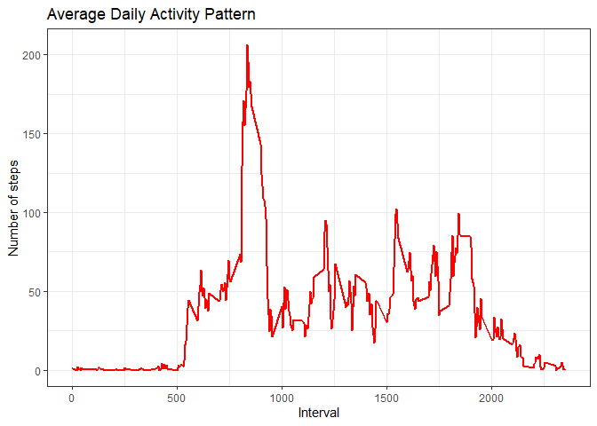
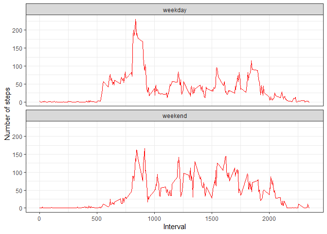

**Loading necessary packages from the library**

```r
library(ggplot2)
```

## Loading and preprocessing the data
**1. Loading the dataset**

```r
a_data <- read.csv('activity.csv', header = TRUE, sep=",", colClasses=c("numeric", "character", "numeric"))
```

**2. Tidying the dataset**

```r
a_data$date <- as.Date(a_data$date, format = "%Y-%m-%d")
a_data$interval <- as.factor(a_data$interval)
```

## What is mean total number of steps taken per day?
**1. Calculating daily step counts.**

```r
steps_taken_per_day <- aggregate(steps ~ date, a_data, sum)
colnames(steps_taken_per_day) <- c("date","steps")
```

**2. Plotting the Histogram of the total number of steps taken each day.**

```r
hist_O<-ggplot(steps_taken_per_day, aes(x = steps)) + 
  geom_histogram(binwidth = 1000) + 
  labs(title="Histogram of Steps Taken per Day", 
       x = "Number of Steps per Day", y = "Number of times in a day") + theme_bw()

hist_O
```

<!-- -->

**3. The mean and median of steps taken.**

```r
steps_mean   <- mean(steps_taken_per_day$steps, na.rm=TRUE)
steps_median <- median(steps_taken_per_day$steps, na.rm=TRUE)
```

Mean:1.0766189\times 10^{4}

Median:1.0765\times 10^{4}

## What is the average daily activity pattern?

**1. Calculating the aggregate of steps by intervals of 5-minutes.**

```r
steps_taken_per_interval <- aggregate(a_data$steps, by = list(interval = a_data$interval), FUN=mean, na.rm=TRUE)
```

**2. Converting the data set to integer values for making it easier to plot the graph.**

```r
steps_taken_per_interval$interval <-     
   as.integer(levels(steps_taken_per_interval$interval)[steps_taken_per_interval$interval])

colnames(steps_taken_per_interval) <- c("interval", "steps")
```

**3. Plot with the time series of the average number of steps taken in 5-minute intervals:**

```r
time_series_plot<-ggplot(steps_taken_per_interval, aes(x=interval, y=steps)) +   
   geom_line(color="red", size=1) +  
   labs(title="Average Daily Activity Pattern", x="Interval", y="Number of steps") +  
   theme_bw()
time_series_plot
```

<!-- -->

**4. Calculating the highest 5 minute interval.**

```r
max_interval <- steps_taken_per_interval[which.max(steps_taken_per_interval$steps),]
```

The 835 is the highest interval, with 206.1698113 steps.

## Imputing missing values

**1. Using is.na() method to check whether the value is mising or not.**

```r
missing_vals <- sum(is.na(a_data$steps))
```

There are 2304 missing values.

**2. filling in all of the missing values in the dataset.**

```r
fill_mv <- function(data, pervalue) {
   na_index <- which(is.na(data$steps))
   na_replace <- unlist(lapply(na_index, FUN=function(idx){
     interval = data[idx,]$interval
     pervalue[pervalue$interval == interval,]$steps
   }))
   fill_steps <- data$steps
   fill_steps[na_index] <- na_replace
   fill_steps
}

a_data_fill <- data.frame(  
   steps = fill_mv(a_data, steps_taken_per_interval),  
   date = a_data$date,  
   interval = a_data$interval)
```

**3. Checking the number of missing values after filling up the dataset.**

```r
sum_mv_fill<-sum(is.na(a_data_fill$steps))
```

The number of missing values after filling the data is 0.

**4. Calculating the new daily step counts.**

```r
fill_steps_taken_per_day <- aggregate(steps ~ date, a_data_fill, sum)
colnames(fill_steps_taken_per_day) <- c("date","steps")
```

**5. Histogram of the total number of steps taken each day after filling the missing values.**

```r
##plotting the histogram
ggplot(fill_steps_taken_per_day, aes(x = steps)) + 
   geom_histogram(binwidth = 1000) + 
   labs(title="Histogram of Steps Taken per Day", 
       x = "Number of Steps per Day", y = "Number of times in a day") + theme_bw() 
```

<!-- -->

**6. The mean and median of steps taken after filling the missing values.**

```r
steps_mean_after_fill <- mean(fill_steps_taken_per_day$steps, na.rm=TRUE)
steps_median_after_fill <- median(fill_steps_taken_per_day$steps, na.rm=TRUE)
```

New Mean: 1.0766189\times 10^{4}.

New Median: 1.0766189\times 10^{4}.

Therefore, we can see that the **New Mean** of the dataset is exactly the same as before and after filling the missing values, while the **New Median** has shifted towards, and is equal to the **New Mean**.

## Are there differences in activity patterns between weekdays and weekends?

**1. Function to add a column to the dataset to indicate the day of the week.**

```r
weeks_data <- function(data) {
    weeks_data <- aggregate(data$steps, by=list(interval = data$interval), FUN=mean, na.rm=T)
    weeks_data$interval <- as.integer(levels(weeks_data$interval)[weeks_data$interval])
    colnames(weeks_data) <- c("interval", "steps")
    weeks_data
}
```

**2. Function to distinguish between weekdays and weekends.**

```r
data_by_weekdays <- function(data) {
    data$weekday <- as.factor(weekdays(data$date))
    week_end <- subset(data, weekday %in% c("Saturday","Sunday"))
    week_day <- subset(data, !weekday %in% c("Saturday","Sunday"))

    week_end_steps <- weeks_data(week_end)
    week_day_steps <- weeks_data(week_day)

    week_end_steps$day_of_week <- rep("weekend", nrow(week_end_steps))
    week_day_steps$day_of_week <- rep("weekday", nrow(week_day_steps))

    data_by_weekdays <- rbind(week_end_steps, week_day_steps)
    data_by_weekdays$day_of_week <- as.factor(data_by_weekdays$day_of_week)
    data_by_weekdays
}
```

**3. Separating the data on the basis of weekdays and weekends**

```r
data_weekdays <- data_by_weekdays(a_data_fill)
```

**4. Plot to compare the average number of steps taken per 5-minute interval across weekdays and weekends:**

```r
plot_o_week <- ggplot(data_weekdays, aes(x=interval, y=steps)) + 
    geom_line(color="red") + 
    facet_wrap(~ day_of_week, nrow=2, ncol=1) +
    labs(x="Interval", y="Number of steps") +
    theme_bw()

plot_o_week
```

<!-- -->

Peak of the graph on weekdays is greater than the peak of the graph on weekends, although weekends have more peaks than weekdays.
